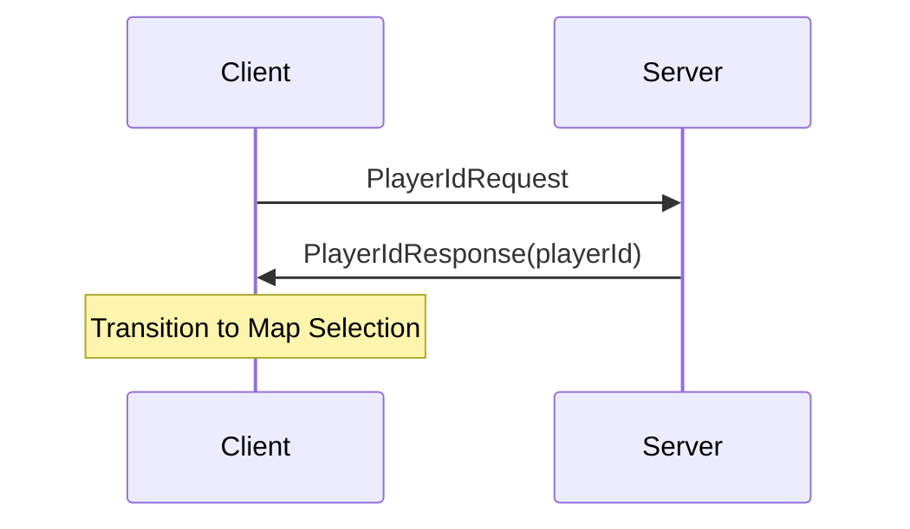
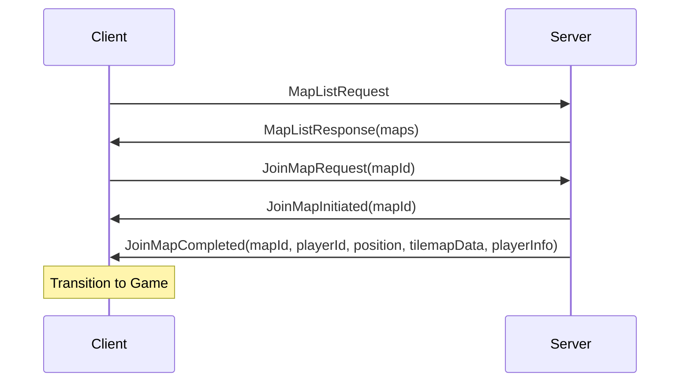
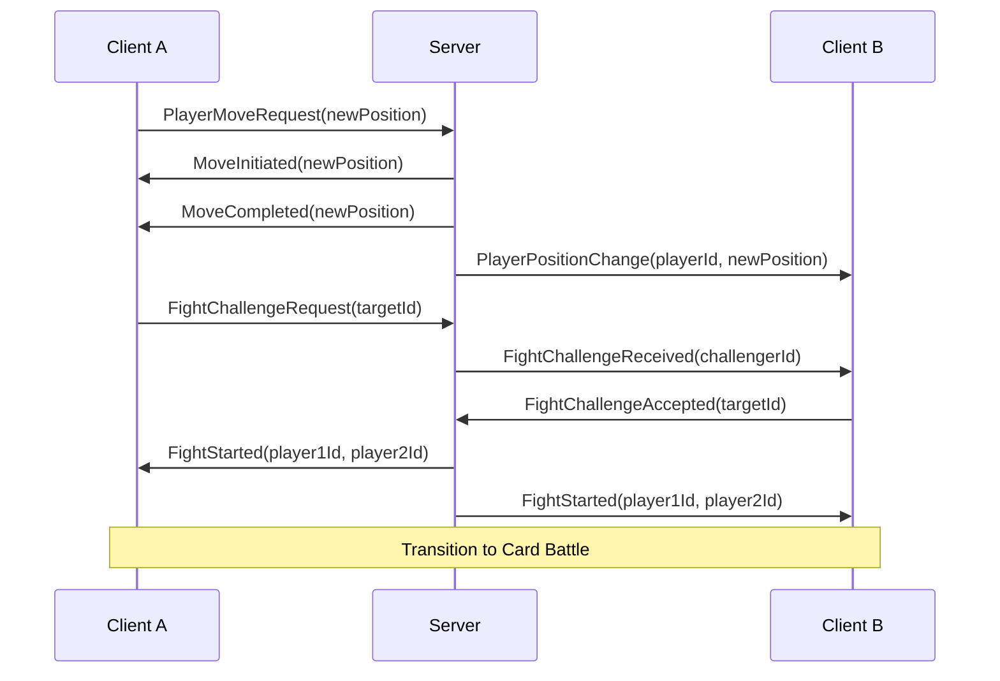
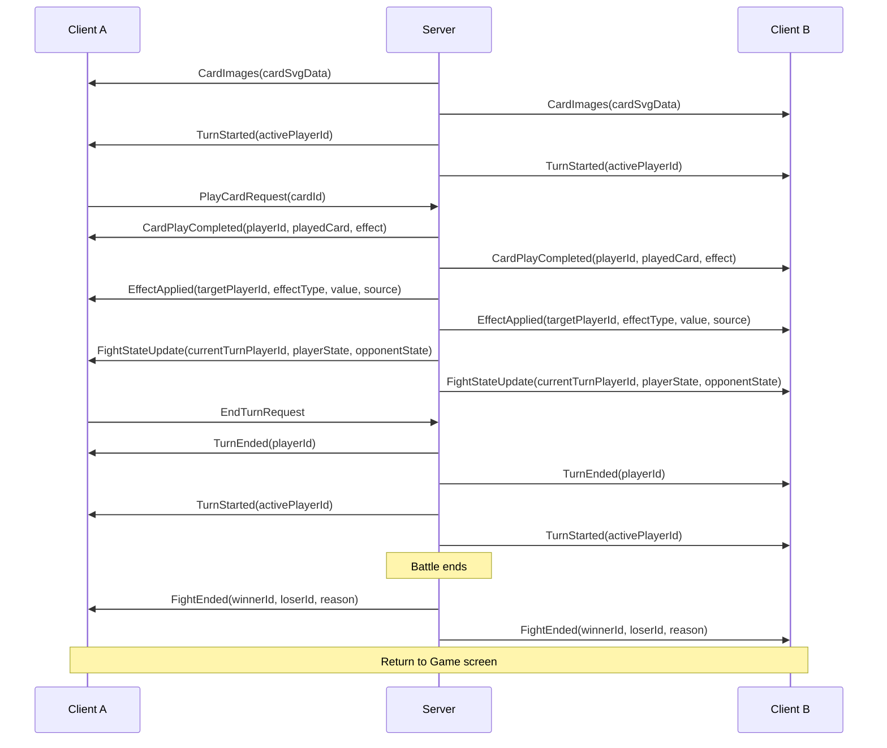

# External Messages Reference: Client-Server Communication

## 1. Introduction

This document provides a comprehensive reference for the messages exchanged between the client and server in the Chicken Fight game. These messages, organized in domain-specific files under `GameServer.Shared.Messages`, form the communication backbone of the game, enabling real-time interaction between clients and the server.

All messages follow a consistent organization and hierarchy, with client-to-server messages inheriting from `ClientMessage` and server-to-client messages inheriting from `ServerMessage`. Messages also implement interfaces that define their purpose and common properties. This document details each message type, its properties, and the client states/flows where it is applicable.

## 2. Message Organization

### 2.1 File Structure

Messages are organized by domain in separate files:

```
GameServer.Shared/
├── Messages/
│   ├── Base/
│   │   ├── MessageBase.cs         (Base message classes)
│   │   └── MessageInterfaces.cs   (Common interfaces)
│   ├── Connection/
│   │   └── ConnectionMessages.cs  (Connection-related messages)
│   ├── Map/
│   │   ├── MapMessages.cs         (Map navigation messages)
│   │   └── MapDTOs.cs             (Map-related data objects)
│   ├── Movement/
│   │   └── MovementMessages.cs    (Player movement messages)
│   ├── Fight/
│   │   └── FightMessages.cs       (Fight challenge messages)
│   ├── CardBattle/
│   │   ├── CardBattleMessages.cs  (Card battle gameplay messages)
│   │   └── CardBattleDTOs.cs      (Card-related data objects)
│   └── State/
│       └── StateMessages.cs       (State update messages)
```

### 2.2 Message Hierarchy

All messages inherit from a base hierarchy that provides type information:

```
MessageBase
├── ClientMessage (client → server)
└── ServerMessage (server → client)
```

- **MessageBase**: Abstract base class that automatically sets the `MessageType` property to the derived class name
- **ClientMessage**: Base class for all messages sent from client to server
- **ServerMessage**: Base class for all messages sent from server to client

### 2.3 Message Interfaces

Messages implement interfaces that define their purpose and common properties:

- **IRequest**: Messages that represent requests from client to server
- **IResponse**: Messages that represent responses to requests (with Success/Error properties)
- **INotification**: Messages that represent notifications (no response expected)
- **IMapRelated**: Messages related to a specific map
- **IPlayerRelated**: Messages related to a specific player

## 3. Client States and Message Flows

The client application has four main states, each handling specific message types:

### 3.1 Title Screen Flow

The Title screen is the entry point to the game, handling initial connection to the server.

**Messages:**
- Client sends `PlayerIdRequest` to request connection confirmation
- Server responds with `PlayerIdResponse` containing the player's unique ID
- On successful connection, client transitions to Map Selection screen



### 3.2 Map Selection Flow

The Map Selection screen allows players to choose a map to join.

**Messages:**
- Client sends `MapListRequest` to get available maps
- Server responds with `MapListResponse` containing map information
- Client sends `JoinMapRequest` to join a selected map
- Server responds with sequence: `JoinMapInitiated` → `JoinMapCompleted` (or `JoinMapFailed`)
- On successful join, client transitions to Game screen



### 3.3 Game Map Flow

The Game screen displays the map and players, handling movement and fight challenges.

**Messages:**
- Client sends `PlayerMoveRequest` to move on the map
- Server responds with sequence: `MoveInitiated` → `MoveCompleted` (or `MoveFailed`)
- Server broadcasts `PlayerPositionChange` to other players
- Client sends `FightChallengeRequest` to challenge another player
- Server sends `FightChallengeReceived` to the challenged player
- Challenged player sends `FightChallengeAccepted` to accept
- Server broadcasts `FightStarted` to both players
- On fight start, client transitions to Card Battle overlay



### 3.4 Card Battle Flow

The Card Battle overlay handles the turn-based card game between two players.

**Messages:**
- Server sends `CardImages` with SVG data for cards
- Server sends `FightStateUpdate` with complete battle state
- Server sends `TurnStarted` to indicate whose turn it is
- Client sends `PlayCardRequest` to play a card
- Server responds with `CardPlayCompleted` (or `CardPlayFailed`)
- Server sends `EffectApplied` for each effect
- Client sends `EndTurnRequest` to end their turn
- Server sends `TurnEnded` followed by `TurnStarted` for the next player
- When battle ends, server sends `FightEnded` to both players
- On battle end, client returns to Game screen



## 4. Message Categories

### 4.1 Connection Messages

These messages handle the initial connection between client and server.

| Message | Direction | Purpose | Properties |
|---------|-----------|---------|------------|
| `PlayerIdRequest` | Client → Server | Request connection confirmation | None |
| `PlayerIdResponse` | Server → Client | Confirm connection with player ID | `PlayerId`: Unique identifier for the player |

**Client State**: Title Screen

**Flow**:
1. Client connects to WebSocket server
2. Client sends `PlayerIdRequest`
3. Server generates a unique player ID and responds with `PlayerIdResponse`
4. Client stores the player ID and transitions to Map Selection screen

### 4.2 Map Navigation Messages

These messages handle map listing, joining, and leaving.

| Message | Direction | Purpose | Properties |
|---------|-----------|---------|------------|
| `MapListRequest` | Client → Server | Request available maps | None |
| `MapListResponse` | Server → Client | Provide list of available maps | `Maps`: List of `MapInfo` objects |
| `JoinMapRequest` | Client → Server | Request to join a map | `MapId`: ID of the map to join |
| `LeaveMapRequest` | Client → Server | Request to leave a map | `MapId`: ID of the map to leave |
| `JoinMapInitiated` | Server → Client | Notify that map join process started | `MapId`: ID of the map being joined |
| `JoinMapCompleted` | Server → Client | Notify that map join completed | `MapId`, `PlayerId`, `Position`, `TilemapData`, `PlayerInfo` |
| `JoinMapFailed` | Server → Client | Notify that map join failed | `MapId`, `Error`: Reason for failure |
| `LeaveMapInitiated` | Server → Client | Notify that map leave process started | `MapId`: ID of the map being left |
| `LeaveMapCompleted` | Server → Client | Notify that map leave completed | `MapId`: ID of the map that was left |
| `LeaveMapFailed` | Server → Client | Notify that map leave failed | `MapId`, `Error`: Reason for failure |

**Client State**: Map Selection Screen, Game Screen

**Flow**:
1. Client sends `MapListRequest` to get available maps
2. Server responds with `MapListResponse` containing map information
3. Client displays maps and allows user to select one
4. Client sends `JoinMapRequest` with the selected map ID
5. Server responds with `JoinMapInitiated` to acknowledge the request
6. Server processes the join request and responds with either:
   - `JoinMapCompleted` with map data if successful
   - `JoinMapFailed` with an error message if unsuccessful
7. On successful join, client transitions to Game screen
8. When leaving a map, client sends `LeaveMapRequest`
9. Server responds with `LeaveMapInitiated`, then either `LeaveMapCompleted` or `LeaveMapFailed`

### 4.3 Player Presence Messages

These messages notify about players joining and leaving maps.

| Message | Direction | Purpose | Properties |
|---------|-----------|---------|------------|
| `PlayerJoinedMap` | Server → Client | Notify that a player joined the map | `PlayerId`, `Position`: Player's initial position |
| `PlayerLeftMap` | Server → Client | Notify that a player left the map | `PlayerId`: ID of the player who left |

**Client State**: Game Screen

**Flow**:
1. When a player joins a map, server broadcasts `PlayerJoinedMap` to all other players on the map
2. Client adds the new player to the game view
3. When a player leaves a map, server broadcasts `PlayerLeftMap` to all other players on the map
4. Client removes the player from the game view

### 4.4 Movement Messages

These messages handle player movement on the map.

| Message | Direction | Purpose | Properties |
|---------|-----------|---------|------------|
| `PlayerMoveRequest` | Client → Server | Request to move to a new position | `NewPosition`: Target position |
| `MoveInitiated` | Server → Client | Notify that move process started | `NewPosition`: Target position |
| `MoveCompleted` | Server → Client | Notify that move completed | `NewPosition`: New position |
| `MoveFailed` | Server → Client | Notify that move failed | `AttemptedPosition`, `Error`: Reason for failure |
| `PlayerPositionChange` | Server → Client | Notify of another player's position change | `PlayerId`, `Position`: New position |

**Client State**: Game Screen

**Flow**:
1. Client sends `PlayerMoveRequest` with the target position
2. Server validates the move and responds with `MoveInitiated`
3. Server processes the move and responds with either:
   - `MoveCompleted` with the new position if successful
   - `MoveFailed` with an error message if unsuccessful
4. Server broadcasts `PlayerPositionChange` to all other players on the map
5. Client updates the player's position on successful move

### 4.5 State Update Messages

These messages provide updates about player state.

| Message | Direction | Purpose | Properties |
|---------|-----------|---------|------------|
| `PlayerInfo` | Server → Client | Provide player information | `State`: Player state information |

**Client State**: Game Screen

**Flow**:
1. Server sends `PlayerInfo` to update client about player state changes
2. Client updates the local game state with the new information

### 4.6 Fight Challenge Messages

These messages handle initiating fights between players.

| Message | Direction | Purpose | Properties |
|---------|-----------|---------|------------|
| `FightChallengeRequest` | Client → Server | Send a fight challenge to another player | `TargetId`: ID of the challenged player |
| `FightChallengeReceived` | Server → Client | Notify that a fight challenge was received | `ChallengerId`: ID of the challenging player |
| `FightChallengeAccepted` | Client → Server | Accept a fight challenge | `TargetId`: ID of the challenging player |
| `FightStarted` | Server → Client | Notify that a fight has started | `Player1Id`, `Player2Id`: IDs of the fighting players |
| `FightEnded` | Server → Client | Notify that a fight has ended | `WinnerId`, `LoserId`, `Reason`: Reason for fight ending |

**Client State**: Game Screen, Card Battle Screen

**Flow**:
1. Client sends `FightChallengeRequest` with the target player's ID
2. Server sends `FightChallengeReceived` to the challenged player
3. Challenged player sends `FightChallengeAccepted` to accept the challenge
4. Server broadcasts `FightStarted` to both players
5. Both clients transition to Card Battle screen
6. When the fight ends, server broadcasts `FightEnded` to both players
7. Both clients return to Game screen

### 4.7 Card Battle Messages

These messages handle the card battle gameplay.

| Message | Direction | Purpose | Properties |
|---------|-----------|---------|------------|
| `CardImages` | Server → Client | Provide SVG data for cards | `CardSvgData`: Dictionary mapping card IDs to SVG data |
| `CardDrawn` | Server → Client | Notify about a newly drawn card | `CardInfo`, `SvgData`: Card information and visual data |
| `FightStateUpdate` | Server → Client | Provide complete fight state update | `CurrentTurnPlayerId`, `PlayerState`, `OpponentState` |
| `TurnStarted` | Server → Client | Notify that a turn has started | `ActivePlayerId`: ID of the player whose turn it is |
| `TurnEnded` | Server → Client | Notify that a turn has ended | `PlayerId`: ID of the player whose turn ended |
| `PlayCardRequest` | Client → Server | Request to play a card | `CardId`: ID of the card to play |
| `CardPlayInitiated` | Server → Client | Notify that card play process started | `CardId`: ID of the card being played |
| `CardPlayCompleted` | Server → Client | Notify that card play completed | `PlayerId`, `PlayedCard`, `Effect`, `IsVisible` |
| `CardPlayFailed` | Server → Client | Notify that card play failed | `CardId`, `Error`: Reason for failure |
| `EffectApplied` | Server → Client | Notify about a card effect being applied | `TargetPlayerId`, `EffectType`, `Value`, `Source` |
| `EndTurnRequest` | Client → Server | Request to end the current turn | None |

**Client State**: Card Battle Screen

**Flow**:
1. When a fight starts, server sends `CardImages` with SVG data for cards
2. Server sends `FightStateUpdate` with initial fight state
3. Server sends `TurnStarted` to indicate whose turn it is
4. During a player's turn:
   - Server may send `CardDrawn` for newly drawn cards
   - Player can send `PlayCardRequest` to play a card
   - Server responds with `CardPlayCompleted` or `CardPlayFailed`
   - Server sends `EffectApplied` for each effect
   - Server sends updated `FightStateUpdate`
5. Player sends `EndTurnRequest` to end their turn
6. Server sends `TurnEnded` followed by `TurnStarted` for the next player
7. This cycle continues until the fight ends
8. Server sends `FightEnded` to both players when the fight is over

## 5. Detailed Message Reference

### 5.1 Base Message Types

#### MessageBase
Abstract base class for all messages.
- **Properties**:
  - `MessageType`: String containing the derived class name

#### ClientMessage
Base class for all messages sent from client to server.
- **Inherits from**: `MessageBase`

#### ServerMessage
Base class for all messages sent from server to client.
- **Inherits from**: `MessageBase`

### 5.2 Connection Messages

#### PlayerIdRequest
Client request for connection confirmation.
- **Namespace**: `GameServer.Shared.Messages.Connection`
- **Inherits from**: `ClientMessage`
- **Implements**: `IRequest`
- **Properties**: None

#### PlayerIdResponse
Server response with connection confirmation.
- **Namespace**: `GameServer.Shared.Messages.Connection`
- **Inherits from**: `ServerMessage`
- **Implements**: `IResponse`, `IPlayerRelated`
- **Properties**:
  - `PlayerId`: String containing the player's unique ID
  - `Success`: Boolean indicating success (always true)
  - `ErrorMessage`: String containing error message (always empty)

### 5.3 Map Navigation Messages

#### MapListRequest
Client request for available maps.
- **Namespace**: `GameServer.Shared.Messages.Map`
- **Inherits from**: `ClientMessage`
- **Implements**: `IRequest`
- **Properties**: None

#### MapListResponse
Server response with available maps.
- **Namespace**: `GameServer.Shared.Messages.Map`
- **Inherits from**: `ServerMessage`
- **Implements**: `IResponse`
- **Properties**:
  - `Maps`: List of `MapInfo` objects
  - `Success`: Boolean indicating success (always true)
  - `ErrorMessage`: String containing error message (always empty)

#### MapInfo
Information about a map.
- **Namespace**: `GameServer.Shared.Messages.Map`
- **Properties**:
  - `Id`: String containing the map's unique ID
  - `Name`: String containing the map's display name
  - `Width`: Integer representing the map width
  - `Height`: Integer representing the map height
  - `PlayerCount`: Integer representing the number of players on the map

#### JoinMapRequest
Client request to join a map.
- **Namespace**: `GameServer.Shared.Messages.Map`
- **Inherits from**: `ClientMessage`
- **Implements**: `IRequest`, `IMapRelated`
- **Properties**:
  - `MapId`: String containing the ID of the map to join

#### LeaveMapRequest
Client request to leave a map.
- **Namespace**: `GameServer.Shared.Messages.Map`
- **Inherits from**: `ClientMessage`
- **Implements**: `IRequest`, `IMapRelated`
- **Properties**:
  - `MapId`: String containing the ID of the map to leave

#### JoinMapInitiated
Server notification that map join process has started.
- **Namespace**: `GameServer.Shared.Messages.Map`
- **Inherits from**: `ServerMessage`
- **Implements**: `INotification`, `IMapRelated`
- **Properties**:
  - `MapId`: String containing the ID of the map being joined

#### JoinMapCompleted
Server notification that map join has completed successfully.
- **Namespace**: `GameServer.Shared.Messages.Map`
- **Inherits from**: `ServerMessage`
- **Implements**: `IResponse`, `IMapRelated`, `IPlayerRelated`
- **Properties**:
  - `MapId`: String containing the ID of the joined map
  - `PlayerId`: String containing the player's ID
  - `Position`: `MapPosition` object with the player's initial position
  - `TilemapData`: `TilemapData` object with the map's tile data
  - `PlayerInfo`: Dictionary mapping player IDs to `PlayerMapInfo` objects
  - `Success`: Boolean indicating success (always true)
  - `ErrorMessage`: String containing error message (always empty)

#### JoinMapFailed
Server notification that map join has failed.
- **Namespace**: `GameServer.Shared.Messages.Map`
- **Inherits from**: `ServerMessage`
- **Implements**: `IResponse`, `IMapRelated`
- **Properties**:
  - `MapId`: String containing the ID of the map that failed to join
  - `Success`: Boolean indicating success (always false)
  - `ErrorMessage`: String containing the reason for failure

#### LeaveMapInitiated
Server notification that map leave process has started.
- **Namespace**: `GameServer.Shared.Messages.Map`
- **Inherits from**: `ServerMessage`
- **Implements**: `INotification`, `IMapRelated`
- **Properties**:
  - `MapId`: String containing the ID of the map being left

#### LeaveMapCompleted
Server notification that map leave has completed successfully.
- **Namespace**: `GameServer.Shared.Messages.Map`
- **Inherits from**: `ServerMessage`
- **Implements**: `IResponse`, `IMapRelated`
- **Properties**:
  - `MapId`: String containing the ID of the map that was left
  - `Success`: Boolean indicating success (always true)
  - `ErrorMessage`: String containing error message (always empty)

#### LeaveMapFailed
Server notification that map leave has failed.
- **Namespace**: `GameServer.Shared.Messages.Map`
- **Inherits from**: `ServerMessage`
- **Implements**: `IResponse`, `IMapRelated`
- **Properties**:
  - `MapId`: String containing the ID of the map that failed to leave
  - `Success`: Boolean indicating success (always false)
  - `ErrorMessage`: String containing the reason for failure

#### PlayerJoinedMap
Server notification that a player has joined the map.
- **Namespace**: `GameServer.Shared.Messages.Map`
- **Inherits from**: `ServerMessage`
- **Implements**: `INotification`, `IPlayerRelated`
- **Properties**:
  - `PlayerId`: String containing the ID of the player who joined
  - `Position`: `MapPosition` object with the player's initial position

#### PlayerLeftMap
Server notification that a player has left the map.
- **Namespace**: `GameServer.Shared.Messages.Map`
- **Inherits from**: `ServerMessage`
- **Implements**: `INotification`, `IPlayerRelated`
- **Properties**:
  - `PlayerId`: String containing the ID of the player who left

### 5.4 Movement Messages

#### PlayerMoveRequest
Client request to move player to a new position.
- **Namespace**: `GameServer.Shared.Messages.Movement`
- **Inherits from**: `ClientMessage`
- **Implements**: `IRequest`
- **Properties**:
  - `NewPosition`: `MapPosition` object with the target position

#### MoveInitiated
Server notification that move process has started.
- **Namespace**: `GameServer.Shared.Messages.Movement`
- **Inherits from**: `ServerMessage`
- **Implements**: `INotification`
- **Properties**:
  - `NewPosition`: `MapPosition` object with the target position

#### MoveCompleted
Server notification that move has completed successfully.
- **Namespace**: `GameServer.Shared.Messages.Movement`
- **Inherits from**: `ServerMessage`
- **Implements**: `IResponse`
- **Properties**:
  - `NewPosition`: `MapPosition` object with the new position
  - `Success`: Boolean indicating success (always true)
  - `ErrorMessage`: String containing error message (always empty)

#### MoveFailed
Server notification that move has failed.
- **Namespace**: `GameServer.Shared.Messages.Movement`
- **Inherits from**: `ServerMessage`
- **Implements**: `IResponse`
- **Properties**:
  - `AttemptedPosition`: `MapPosition` object with the attempted position
  - `Success`: Boolean indicating success (always false)
  - `ErrorMessage`: String containing the reason for failure

#### PlayerPositionChange
Server notification of a player position change.
- **Namespace**: `GameServer.Shared.Messages.Movement`
- **Inherits from**: `ServerMessage`
- **Implements**: `INotification`, `IPlayerRelated`
- **Properties**:
  - `PlayerId`: String containing the ID of the player who moved
  - `Position`: `MapPosition` object with the player's new position

### 5.5 State Update Messages

#### PlayerState
Information about a player's state.
- **Namespace**: `GameServer.Shared.Messages.State`
- **Properties**:
  - `Id`: String containing the player's ID
  - `Name`: String containing the player's name
  - `Position`: `MapPosition` object with the player's position
  - `FightId`: String containing the ID of the fight the player is in (if any)

#### PlayerInfo
Server notification with player information.
- **Namespace**: `GameServer.Shared.Messages.State`
- **Inherits from**: `ServerMessage`
- **Implements**: `INotification`
- **Properties**:
  - `State`: `PlayerState` object with the player's state information

### 5.6 Fight Challenge Messages

#### FightChallengeRequest
Client request to send a fight challenge to another player.
- **Namespace**: `GameServer.Shared.Messages.Fight`
- **Inherits from**: `ClientMessage`
- **Implements**: `IRequest`
- **Properties**:
  - `TargetId`: String containing the ID of the challenged player

#### FightChallengeReceived
Server notification that a fight challenge was received.
- **Namespace**: `GameServer.Shared.Messages.Fight`
- **Inherits from**: `ServerMessage`
- **Implements**: `INotification`
- **Properties**:
  - `ChallengerId`: String containing the ID of the challenging player

#### FightChallengeAccepted
Client request to accept a fight challenge.
- **Namespace**: `GameServer.Shared.Messages.Fight`
- **Inherits from**: `ClientMessage`
- **Implements**: `IRequest`
- **Properties**:
  - `TargetId`: String containing the ID of the challenging player

#### FightStarted
Server notification that a fight has started.
- **Namespace**: `GameServer.Shared.Messages.Fight`
- **Inherits from**: `ServerMessage`
- **Implements**: `INotification`
- **Properties**:
  - `Player1Id`: String containing the ID of the first player
  - `Player2Id`: String containing the ID of the second player

#### FightEnded
Server notification that a fight has ended.
- **Namespace**: `GameServer.Shared.Messages.Fight`
- **Inherits from**: `ServerMessage`
- **Implements**: `INotification`
- **Properties**:
  - `WinnerId`: String containing the ID of the winning player
  - `LoserId`: String containing the ID of the losing player
  - `Reason`: String containing the reason for the fight ending

### 5.7 Card Battle Messages

#### CardInfo
Information about a card.
- **Namespace**: `GameServer.Shared.Messages.CardBattle`
- **Properties**:
  - `Id`: String containing the card's unique ID
  - `Name`: String containing the card's display name
  - `Description`: String containing the card's description
  - `Cost`: Integer representing the action points required to play the card

#### StatusEffectInfo
Information about a status effect.
- **Namespace**: `GameServer.Shared.Messages.CardBattle`
- **Properties**:
  - `Id`: String containing the effect's unique ID
  - `Name`: String containing the effect's display name
  - `Description`: String containing the effect's description
  - `Duration`: Integer representing the number of turns the effect lasts
  - `Type`: String containing the effect type
  - `Magnitude`: Integer representing the effect's magnitude

#### PlayerFightState
Represents a player's current fight status.
- **Namespace**: `GameServer.Shared.Messages.CardBattle`
- **Properties**:
  - `PlayerId`: String containing the player's ID
  - `HitPoints`: Integer representing the player's hit points
  - `ActionPoints`: Integer representing the player's action points
  - `Hand`: List of `CardInfo` objects representing the player's hand
  - `DeckCount`: Integer representing the number of cards in the player's deck
  - `DiscardPileCount`: Integer representing the number of cards in the player's discard pile
  - `StatusEffects`: List of `StatusEffectInfo` objects representing the player's active status effects

#### CardImages
Server notification with SVG data for multiple cards.
- **Namespace**: `GameServer.Shared.Messages.CardBattle`
- **Inherits from**: `ServerMessage`
- **Implements**: `INotification`
- **Properties**:
  - `CardSvgData`: Dictionary mapping card IDs to SVG data strings

#### CardDrawn
Server notification about a newly drawn card.
- **Namespace**: `GameServer.Shared.Messages.CardBattle`
- **Inherits from**: `ServerMessage`
- **Implements**: `INotification`
- **Properties**:
  - `CardInfo`: `CardInfo` object with information about the drawn card
  - `SvgData`: String containing the SVG data for the card

#### FightStateUpdate
Server notification with complete fight state update.
- **Namespace**: `GameServer.Shared.Messages.CardBattle`
- **Inherits from**: `ServerMessage`
- **Implements**: `INotification`
- **Properties**:
  - `CurrentTurnPlayerId`: String containing the ID of the player whose turn it is
  - `PlayerState`: `PlayerFightState` object with the player's fight state
  - `OpponentState`: `PlayerFightState` object with the opponent's fight state

#### TurnStarted
Server notification that a turn has started.
- **Namespace**: `GameServer.Shared.Messages.CardBattle`
- **Inherits from**: `ServerMessage`
- **Implements**: `INotification`, `IPlayerRelated`
- **Properties**:
  - `ActivePlayerId`: String containing the ID of the player whose turn it is
  - `PlayerId`: String containing the ID of the player whose turn it is (implements IPlayerRelated)

#### TurnEnded
Server notification that a turn has ended.
- **Namespace**: `GameServer.Shared.Messages.CardBattle`
- **Inherits from**: `ServerMessage`
- **Implements**: `INotification`, `IPlayerRelated`
- **Properties**:
  - `PlayerId`: String containing the ID of the player whose turn ended

#### PlayCardRequest
Client request to play a card.
- **Namespace**: `GameServer.Shared.Messages.CardBattle`
- **Inherits from**: `ClientMessage`
- **Implements**: `IRequest`
- **Properties**:
  - `CardId`: String containing the ID of the card to play

#### CardPlayInitiated
Server notification that card play process has started.
- **Namespace**: `GameServer.Shared.Messages.CardBattle`
- **Inherits from**: `ServerMessage`
- **Implements**: `INotification`
- **Properties**:
  - `CardId`: String containing the ID of the card being played

#### CardPlayCompleted
Server notification that card play has completed successfully.
- **Namespace**: `GameServer.Shared.Messages.CardBattle`
- **Inherits from**: `ServerMessage`
- **Implements**: `IResponse`, `IPlayerRelated`
- **Properties**:
  - `PlayerId`: String containing the ID of the player who played the card
