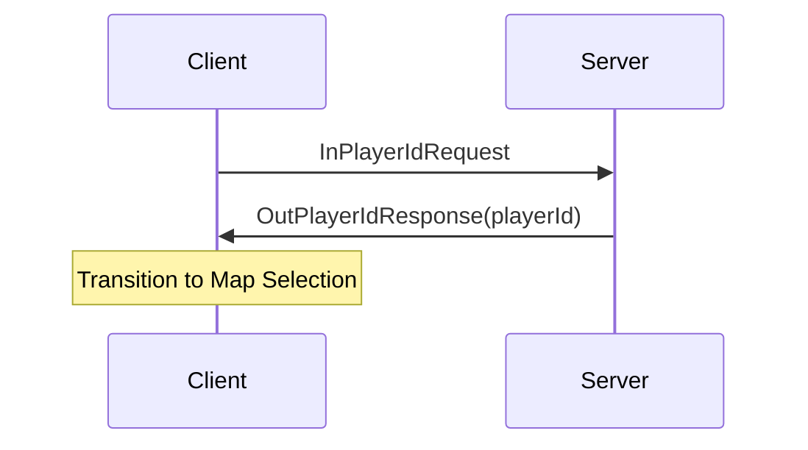
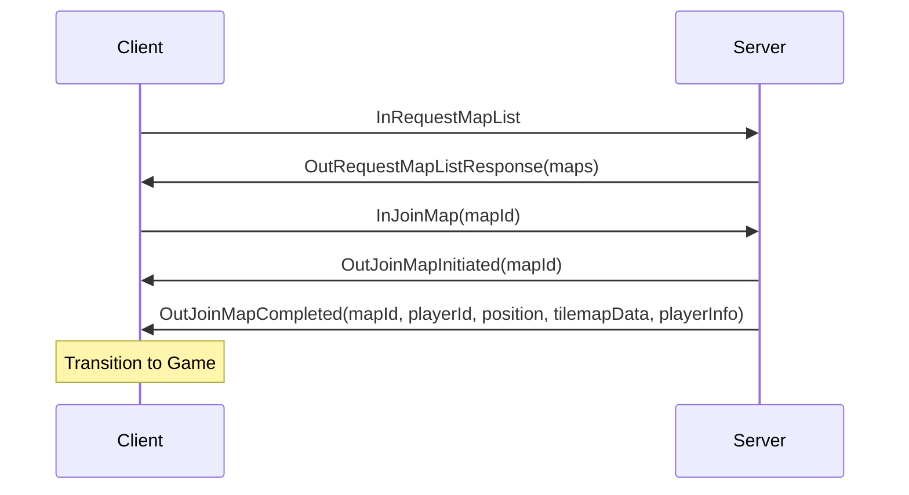
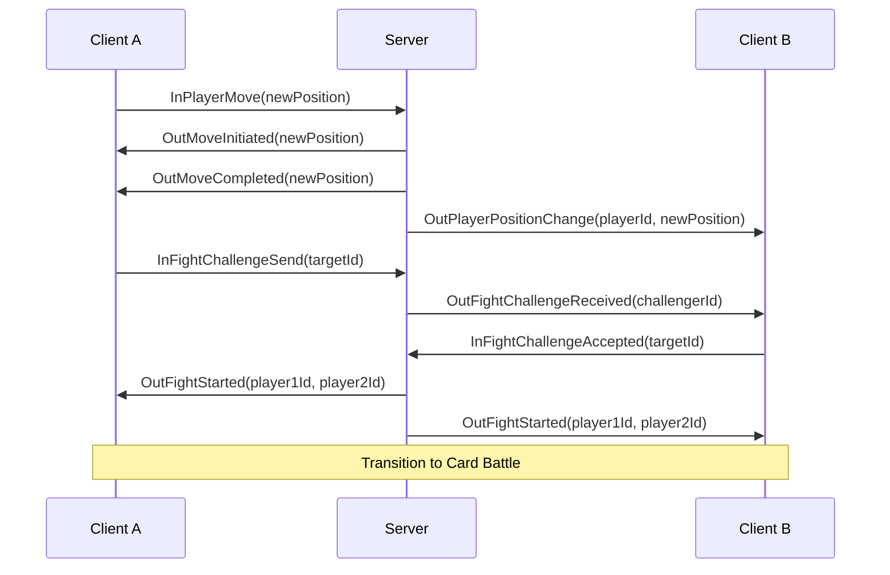
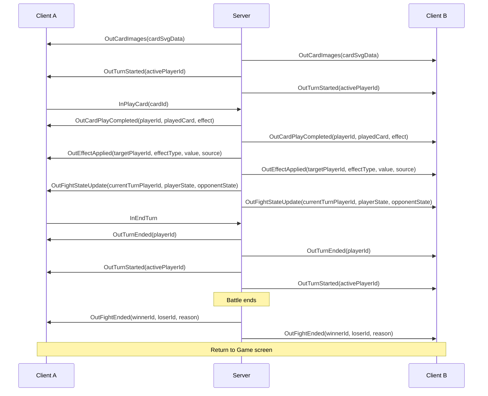

# External Messages Reference: Client-Server Communication

## 1. Introduction

This document provides a comprehensive reference for the messages exchanged between the client and server in the Chicken Fight game. These messages, defined in `GameServer.Shared.ExternalMessages`, form the communication backbone of the game, enabling real-time interaction between clients and the server.

All messages follow a consistent naming convention and hierarchy, with client-to-server messages prefixed with `In` and server-to-client messages prefixed with `Out`. This document details each message type, its properties, and the client states/flows where it is applicable.

## 2. Message Hierarchy

All external messages inherit from a base hierarchy that provides type information:

```
BaseExternalMessage
├── FromClientMessage (client → server, "In" prefix)
└── ToClientMessage (server → client, "Out" prefix)
```

- **BaseExternalMessage**: Abstract base class that automatically sets the `MessageType` property to the derived class name
- **FromClientMessage**: Base class for all messages sent from client to server (prefixed with "In")
- **ToClientMessage**: Base class for all messages sent from server to client (prefixed with "Out")

## 3. Client States and Message Flows

The client application has four main states, each handling specific message types:

### 3.1 Title Screen Flow

The Title screen is the entry point to the game, handling initial connection to the server.

**Messages:**
- Client sends `InPlayerIdRequest` to request connection confirmation
- Server responds with `OutPlayerIdResponse` containing the player's unique ID
- On successful connection, client transitions to Map Selection screen



### 3.2 Map Selection Flow

The Map Selection screen allows players to choose a map to join.

**Messages:**
- Client sends `InRequestMapList` to get available maps
- Server responds with `OutRequestMapListResponse` containing map information
- Client sends `InJoinMap` to join a selected map
- Server responds with sequence: `OutJoinMapInitiated` → `OutJoinMapCompleted` (or `OutJoinMapFailed`)
- On successful join, client transitions to Game screen



### 3.3 Game Map Flow

The Game screen displays the map and players, handling movement and fight challenges.

**Messages:**
- Client sends `InPlayerMove` to move on the map
- Server responds with sequence: `OutMoveInitiated` → `OutMoveCompleted` (or `OutMoveFailed`)
- Server broadcasts `OutPlayerPositionChange` to other players
- Client sends `InFightChallengeSend` to challenge another player
- Server sends `OutFightChallengeReceived` to the challenged player
- Challenged player sends `InFightChallengeAccepted` to accept
- Server broadcasts `OutFightStarted` to both players
- On fight start, client transitions to Card Battle overlay



### 3.4 Card Battle Flow

The Card Battle overlay handles the turn-based card game between two players.

**Messages:**
- Server sends `OutCardImages` with SVG data for cards
- Server sends `OutFightStateUpdate` with complete battle state
- Server sends `OutTurnStarted` to indicate whose turn it is
- Client sends `InPlayCard` to play a card
- Server responds with `OutCardPlayCompleted` (or `OutCardPlayFailed`)
- Server sends `OutEffectApplied` for each effect
- Client sends `InEndTurn` to end their turn
- Server sends `OutTurnEnded` followed by `OutTurnStarted` for the next player
- When battle ends, server sends `OutFightEnded` to both players
- On battle end, client returns to Game screen



## 4. Message Categories

### 4.1 Connection Messages

These messages handle the initial connection between client and server.

| Message | Direction | Purpose | Properties |
|---------|-----------|---------|------------|
| `InPlayerIdRequest` | Client → Server | Request connection confirmation | None |
| `OutPlayerIdResponse` | Server → Client | Confirm connection with player ID | `PlayerId`: Unique identifier for the player |

**Client State**: Title Screen

**Flow**:
1. Client connects to WebSocket server
2. Client sends `InPlayerIdRequest`
3. Server generates a unique player ID and responds with `OutPlayerIdResponse`
4. Client stores the player ID and transitions to Map Selection screen

### 4.2 Map Navigation Messages

These messages handle map listing, joining, and leaving.

| Message | Direction | Purpose | Properties |
|---------|-----------|---------|------------|
| `InRequestMapList` | Client → Server | Request available maps | None |
| `OutRequestMapListResponse` | Server → Client | Provide list of available maps | `Maps`: List of `MapInfo` objects |
| `InJoinMap` | Client → Server | Request to join a map | `MapId`: ID of the map to join |
| `InLeaveMap` | Client → Server | Request to leave a map | `MapId`: ID of the map to leave |
| `OutJoinMapInitiated` | Server → Client | Notify that map join process started | `MapId`: ID of the map being joined |
| `OutJoinMapCompleted` | Server → Client | Notify that map join completed | `MapId`, `PlayerId`, `Position`, `TilemapData`, `PlayerInfo` |
| `OutJoinMapFailed` | Server → Client | Notify that map join failed | `MapId`, `Error`: Reason for failure |
| `OutLeaveMapInitiated` | Server → Client | Notify that map leave process started | `MapId`: ID of the map being left |
| `OutLeaveMapCompleted` | Server → Client | Notify that map leave completed | `MapId`: ID of the map that was left |
| `OutLeaveMapFailed` | Server → Client | Notify that map leave failed | `MapId`, `Error`: Reason for failure |

**Client State**: Map Selection Screen, Game Screen

**Flow**:
1. Client sends `InRequestMapList` to get available maps
2. Server responds with `OutRequestMapListResponse` containing map information
3. Client displays maps and allows user to select one
4. Client sends `InJoinMap` with the selected map ID
5. Server responds with `OutJoinMapInitiated` to acknowledge the request
6. Server processes the join request and responds with either:
   - `OutJoinMapCompleted` with map data if successful
   - `OutJoinMapFailed` with an error message if unsuccessful
7. On successful join, client transitions to Game screen
8. When leaving a map, client sends `InLeaveMap`
9. Server responds with `OutLeaveMapInitiated`, then either `OutLeaveMapCompleted` or `OutLeaveMapFailed`

### 4.3 Player Presence Messages

These messages notify about players joining and leaving maps.

| Message | Direction | Purpose | Properties |
|---------|-----------|---------|------------|
| `OutPlayerJoinedMap` | Server → Client | Notify that a player joined the map | `PlayerId`, `Position`: Player's initial position |
| `OutPlayerLeftMap` | Server → Client | Notify that a player left the map | `PlayerId`: ID of the player who left |

**Client State**: Game Screen

**Flow**:
1. When a player joins a map, server broadcasts `OutPlayerJoinedMap` to all other players on the map
2. Client adds the new player to the game view
3. When a player leaves a map, server broadcasts `OutPlayerLeftMap` to all other players on the map
4. Client removes the player from the game view

### 4.4 Movement Messages

These messages handle player movement on the map.

| Message | Direction | Purpose | Properties |
|---------|-----------|---------|------------|
| `InPlayerMove` | Client → Server | Request to move to a new position | `NewPosition`: Target position |
| `OutMoveInitiated` | Server → Client | Notify that move process started | `NewPosition`: Target position |
| `OutMoveCompleted` | Server → Client | Notify that move completed | `NewPosition`: New position |
| `OutMoveFailed` | Server → Client | Notify that move failed | `AttemptedPosition`, `Error`: Reason for failure |
| `OutPlayerPositionChange` | Server → Client | Notify of another player's position change | `PlayerId`, `Position`: New position |

**Client State**: Game Screen

**Flow**:
1. Client sends `InPlayerMove` with the target position
2. Server validates the move and responds with `OutMoveInitiated`
3. Server processes the move and responds with either:
   - `OutMoveCompleted` with the new position if successful
   - `OutMoveFailed` with an error message if unsuccessful
4. Server broadcasts `OutPlayerPositionChange` to all other players on the map
5. Client updates the player's position on successful move

### 4.5 State Update Messages

These messages provide updates about player state.

| Message | Direction | Purpose | Properties |
|---------|-----------|---------|------------|
| `OutPlayerInfo` | Server → Client | Provide player information | `State`: Player state information |

**Client State**: Game Screen

**Flow**:
1. Server sends `OutPlayerInfo` to update client about player state changes
2. Client updates the local game state with the new information

### 4.6 Fight Challenge Messages

These messages handle initiating fights between players.

| Message | Direction | Purpose | Properties |
|---------|-----------|---------|------------|
| `InFightChallengeSend` | Client → Server | Send a fight challenge to another player | `TargetId`: ID of the challenged player |
| `OutFightChallengeReceived` | Server → Client | Notify that a fight challenge was received | `ChallengerId`: ID of the challenging player |
| `InFightChallengeAccepted` | Client → Server | Accept a fight challenge | `TargetId`: ID of the challenging player |
| `OutFightStarted` | Server → Client | Notify that a fight has started | `Player1Id`, `Player2Id`: IDs of the fighting players |
| `OutFightEnded` | Server → Client | Notify that a fight has ended | `WinnerId`, `LoserId`, `Reason`: Reason for fight ending |

**Client State**: Game Screen, Card Battle Screen

**Flow**:
1. Client sends `InFightChallengeSend` with the target player's ID
2. Server sends `OutFightChallengeReceived` to the challenged player
3. Challenged player sends `InFightChallengeAccepted` to accept the challenge
4. Server broadcasts `OutFightStarted` to both players
5. Both clients transition to Card Battle screen
6. When the fight ends, server broadcasts `OutFightEnded` to both players
7. Both clients return to Game screen

### 4.7 Card Battle Messages

These messages handle the card battle gameplay.

| Message | Direction | Purpose | Properties |
|---------|-----------|---------|------------|
| `OutCardImages` | Server → Client | Provide SVG data for cards | `CardSvgData`: Dictionary mapping card IDs to SVG data |
| `OutCardDrawn` | Server → Client | Notify about a newly drawn card | `CardInfo`, `SvgData`: Card information and visual data |
| `OutPlayerFightState` | Server → Client | Provide a player's fight state | `PlayerId`, `HitPoints`, `ActionPoints`, `Hand`, `DeckCount`, `DiscardPileCount`, `StatusEffects` |
| `OutFightStateUpdate` | Server → Client | Provide complete fight state update | `CurrentTurnPlayerId`, `PlayerState`, `OpponentState` |
| `OutTurnStarted` | Server → Client | Notify that a turn has started | `ActivePlayerId`: ID of the player whose turn it is |
| `OutTurnEnded` | Server → Client | Notify that a turn has ended | `PlayerId`: ID of the player whose turn ended |
| `InPlayCard` | Client → Server | Request to play a card | `CardId`: ID of the card to play |
| `OutCardPlayInitiated` | Server → Client | Notify that card play process started | `CardId`: ID of the card being played |
| `OutCardPlayCompleted` | Server → Client | Notify that card play completed | `PlayerId`, `PlayedCard`, `Effect`, `IsVisible` |
| `OutCardPlayFailed` | Server → Client | Notify that card play failed | `CardId`, `Error`: Reason for failure |
| `OutEffectApplied` | Server → Client | Notify about a card effect being applied | `TargetPlayerId`, `EffectType`, `Value`, `Source` |
| `InEndTurn` | Client → Server | Request to end the current turn | None |

**Client State**: Card Battle Screen

**Flow**:
1. When a fight starts, server sends `OutCardImages` with SVG data for cards
2. Server sends `OutFightStateUpdate` with initial fight state
3. Server sends `OutTurnStarted` to indicate whose turn it is
4. During a player's turn:
   - Server may send `OutCardDrawn` for newly drawn cards
   - Player can send `InPlayCard` to play a card
   - Server responds with `OutCardPlayCompleted` or `OutCardPlayFailed`
   - Server sends `OutEffectApplied` for each effect
   - Server sends updated `OutFightStateUpdate`
5. Player sends `InEndTurn` to end their turn
6. Server sends `OutTurnEnded` followed by `OutTurnStarted` for the next player
7. This cycle continues until the fight ends
8. Server sends `OutFightEnded` to both players when the fight is over

## 5. Detailed Message Reference

### 5.1 Base Message Types

#### BaseExternalMessage
Abstract base class for all external messages.
- **Properties**:
  - `MessageType`: String containing the derived class name

#### FromClientMessage
Base class for all messages sent from client to server.
- **Inherits from**: `BaseExternalMessage`

#### ToClientMessage
Base class for all messages sent from server to client.
- **Inherits from**: `BaseExternalMessage`

### 5.2 Connection Messages

#### InPlayerIdRequest
Client request for connection confirmation.
- **Inherits from**: `FromClientMessage`
- **Properties**: None

#### OutPlayerIdResponse
Server response with connection confirmation.
- **Inherits from**: `ToClientMessage`
- **Properties**:
  - `PlayerId`: String containing the player's unique ID

### 5.3 Map Navigation Messages

#### InRequestMapList
Client request for available maps.
- **Inherits from**: `FromClientMessage`
- **Properties**: None

#### OutRequestMapListResponse
Server response with available maps.
- **Inherits from**: `ToClientMessage`
- **Properties**:
  - `Maps`: List of `MapInfo` objects

#### MapInfo
Information about a map.
- **Properties**:
  - `Id`: String containing the map's unique ID
  - `Name`: String containing the map's display name
  - `Width`: Integer representing the map width
  - `Height`: Integer representing the map height
  - `PlayerCount`: Integer representing the number of players on the map

#### InJoinMap
Client request to join a map.
- **Inherits from**: `FromClientMessage`
- **Properties**:
  - `MapId`: String containing the ID of the map to join

#### InLeaveMap
Client request to leave a map.
- **Inherits from**: `FromClientMessage`
- **Properties**:
  - `MapId`: String containing the ID of the map to leave

#### OutJoinMapInitiated
Server notification that map join process has started.
- **Inherits from**: `ToClientMessage`
- **Properties**:
  - `MapId`: String containing the ID of the map being joined

#### OutJoinMapCompleted
Server notification that map join has completed successfully.
- **Inherits from**: `ToClientMessage`
- **Properties**:
  - `MapId`: String containing the ID of the joined map
  - `PlayerId`: String containing the player's ID
  - `Position`: `MapPosition` object with the player's initial position
  - `TilemapData`: `TilemapData` object with the map's tile data
  - `PlayerInfo`: Dictionary mapping player IDs to `PlayerMapInfo` objects

#### OutJoinMapFailed
Server notification that map join has failed.
- **Inherits from**: `ToClientMessage`
- **Properties**:
  - `MapId`: String containing the ID of the map that failed to join
  - `Error`: String containing the reason for failure

#### OutLeaveMapInitiated
Server notification that map leave process has started.
- **Inherits from**: `ToClientMessage`
- **Properties**:
  - `MapId`: String containing the ID of the map being left

#### OutLeaveMapCompleted
Server notification that map leave has completed successfully.
- **Inherits from**: `ToClientMessage`
- **Properties**:
  - `MapId`: String containing the ID of the map that was left

#### OutLeaveMapFailed
Server notification that map leave has failed.
- **Inherits from**: `ToClientMessage`
- **Properties**:
  - `MapId`: String containing the ID of the map that failed to leave
  - `Error`: String containing the reason for failure

### 5.4 Player Presence Messages

#### OutPlayerJoinedMap
Server notification that a player has joined the map.
- **Inherits from**: `ToClientMessage`
- **Properties**:
  - `PlayerId`: String containing the ID of the player who joined
  - `Position`: `MapPosition` object with the player's initial position

#### OutPlayerLeftMap
Server notification that a player has left the map.
- **Inherits from**: `ToClientMessage`
- **Properties**:
  - `PlayerId`: String containing the ID of the player who left

### 5.5 Movement Messages

#### InPlayerMove
Client request to move player to a new position.
- **Inherits from**: `FromClientMessage`
- **Properties**:
  - `NewPosition`: `MapPosition` object with the target position

#### OutMoveInitiated
Server notification that move process has started.
- **Inherits from**: `ToClientMessage`
- **Properties**:
  - `NewPosition`: `MapPosition` object with the target position

#### OutMoveCompleted
Server notification that move has completed successfully.
- **Inherits from**: `ToClientMessage`
- **Properties**:
  - `NewPosition`: `MapPosition` object with the new position

#### OutMoveFailed
Server notification that move has failed.
- **Inherits from**: `ToClientMessage`
- **Properties**:
  - `AttemptedPosition`: `MapPosition` object with the attempted position
  - `Error`: String containing the reason for failure

#### OutPlayerPositionChange
Server notification of a player position change.
- **Inherits from**: `ToClientMessage`
- **Properties**:
  - `PlayerId`: String containing the ID of the player who moved
  - `Position`: `MapPosition` object with the player's new position

### 5.6 State Update Messages

#### PlayerState
Information about a player's state.
- **Properties**:
  - `Id`: String containing the player's ID
  - `Name`: String containing the player's name
  - `Position`: `MapPosition` object with the player's position
  - `FightId`: String containing the ID of the fight the player is in (if any)

#### OutPlayerInfo
Server notification with player information.
- **Inherits from**: `ToClientMessage`
- **Properties**:
  - `State`: `PlayerState` object with the player's state information

### 5.7 Fight Challenge Messages

#### InFightChallengeSend
Client request to send a fight challenge to another player.
- **Inherits from**: `FromClientMessage`
- **Properties**:
  - `TargetId`: String containing the ID of the challenged player

#### OutFightChallengeReceived
Server notification that a fight challenge was received.
- **Inherits from**: `ToClientMessage`
- **Properties**:
  - `ChallengerId`: String containing the ID of the challenging player

#### InFightChallengeAccepted
Client request to accept a fight challenge.
- **Inherits from**: `FromClientMessage`
- **Properties**:
  - `TargetId`: String containing the ID of the challenging player

#### OutFightStarted
Server notification that a fight has started.
- **Inherits from**: `ToClientMessage`
- **Properties**:
  - `Player1Id`: String containing the ID of the first player
  - `Player2Id`: String containing the ID of the second player

#### OutFightEnded
Server notification that a fight has ended.
- **Inherits from**: `ToClientMessage`
- **Properties**:
  - `WinnerId`: String containing the ID of the winning player
  - `LoserId`: String containing the ID of the losing player
  - `Reason`: String containing the reason for the fight ending

### 5.8 Card Battle Messages

#### CardInfo
Information about a card.
- **Properties**:
  - `Id`: String containing the card's unique ID
  - `Name`: String containing the card's display name
  - `Description`: String containing the card's description
  - `Cost`: Integer representing the action points required to play the card

#### StatusEffectInfo
Information about a status effect.
- **Properties**:
  - `Id`: String containing the effect's unique ID
  - `Name`: String containing the effect's display name
  - `Description`: String containing the effect's description
  - `Duration`: Integer representing the number of turns the effect lasts
  - `Type`: String containing the effect type
  - `Magnitude`: Integer representing the effect's magnitude

#### OutPlayerFightState
Server notification with a player's fight state.
- **Inherits from**: `ToClientMessage`
- **Properties**:
  - `PlayerId`: String containing the player's ID
  - `HitPoints`: Integer representing the player's hit points
  - `ActionPoints`: Integer representing the player's action points
  - `Hand`: List of `CardInfo` objects representing the player's hand
  - `DeckCount`: Integer representing the number of cards in the player's deck
  - `DiscardPileCount`: Integer representing the number of cards in the player's discard pile
  - `StatusEffects`: List of `StatusEffectInfo` objects representing the player's active status effects

#### OutFightStateUpdate
Server notification with complete fight state update.
- **Inherits from**: `ToClientMessage`
- **Properties**:
  - `CurrentTurnPlayerId`: String containing the ID of the player whose turn it is
  - `PlayerState`: `OutPlayerFightState` object with the player's fight state
  - `OpponentState`: `OutPlayerFightState` object with the opponent's fight state

#### OutTurnStarted
Server notification that a turn has started.
- **Inherits from**: `ToClientMessage`
- **Properties**:
  - `ActivePlayerId`: String containing the ID of the player whose turn it is

#### OutTurnEnded
Server notification that a turn has ended.
- **Inherits from**: `ToClientMessage`
- **Properties**:
  - `PlayerId`: String containing the ID of the player whose turn ended

#### InPlayCard
Client request to play a card.
- **Inherits from**: `FromClientMessage`
- **Properties**:
  - `CardId`: String containing the ID of the card to play

#### OutCardPlayInitiated
Server notification that card play process has started.
- **Inherits from**: `ToClientMessage`
- **Properties**:
  - `CardId`: String containing the ID of the card being played

#### OutCardPlayCompleted
Server notification that card play has completed successfully.
- **Inherits from**: `ToClientMessage`
- **Properties**:
  - `PlayerId`: String containing the ID of the player who played the card
  - `PlayedCard`: `CardInfo` object with information about the played card
  - `Effect`: String containing a description of the card's effect
  - `IsVisible`: Boolean indicating whether the card is visible to the opponent

#### OutCardPlayFailed
Server notification that card play has failed.
- **Inherits from**: `ToClientMessage`
- **Properties**:
  - `CardId`: String containing the ID of the card that failed to play
  - `Error`: String containing the reason for failure

#### OutEffectApplied
Server notification that a card effect was applied.
- **Inherits from**: `ToClientMessage`
- **Properties**:
  - `TargetPlayerId`: String containing the ID of the player the effect was applied to
  - `EffectType`: String containing the type of effect
  - `Value`: Integer representing the magnitude of the effect
  - `Source`: String containing the source of the effect

#### OutCardImages
Server notification with SVG data for multiple cards.
- **Inherits from**: `ToClientMessage`
- **Properties**:
  - `CardSvgData`: Dictionary mapping card IDs to SVG data strings

#### OutCardDrawn
Server notification about a newly drawn card.
- **Inherits from**: `ToClientMessage`
- **Properties**:
  - `CardInfo`: `CardInfo` object with information about the drawn card
  - `SvgData`: String containing the SVG data for the card

#### InEndTurn
Client request to end the current turn.
- **Inherits from**: `FromClientMessage`
- **Properties**: None

### 5.9 Map Data Messages

#### TilemapData
Information about a tilemap.
- **Properties**:
  - `Width`: Integer representing the tilemap width
  - `Height`: Integer representing the tilemap height
  - `TileData`: Array of integers representing the tile IDs

## 6. Conclusion

This document provides a comprehensive reference for the external messages used in the Chicken Fight game. Understanding these messages and their flow through different client states is essential for developing and maintaining the game's networking functionality.

The message system follows a consistent pattern of request-response and notification messages, with clear naming conventions and hierarchies. This design enables the client and server to communicate effectively in real-time, providing a seamless multiplayer experience.
